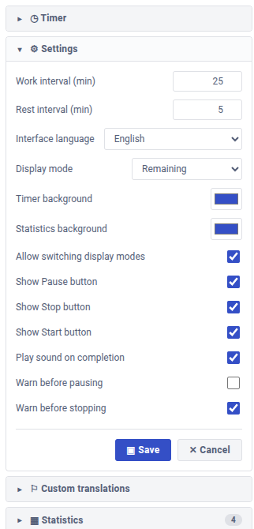
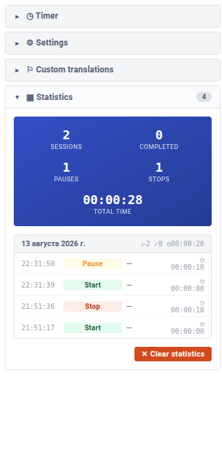

# JopPomidorko

**A Pomodoro timer with statistics, translations, and customizable design for [Joplin](https://joplinapp.org/)**

*by Aleksei Shevchenko • © 2026*

---

### **[English](#english) | [Русский](#russian)**

---

## English

**JopPomidorko** is a productivity plugin for Joplin that brings the classic Pomodoro Technique right into your note-taking workflow. Track focused work sessions, link them to specific notes, and see detailed statistics about your productivity — all without leaving your favorite note app.

---

### Features

- Full Pomodoro flow — work intervals, breaks, pauses, stops, and completion tracking
- Rich statistics — grouped by day, with totals for sessions, completions, pauses, and total focused time
- Note linking — each pomodoro is linked to the currently selected Joplin note (title, UUID, URL)
- 9 built-in languages — English, Русский, Deutsch, Español, Português, Français, Српски, 中文, 日本語
- Instant language switching — change the UI language on the fly, no restart needed
- Customizable design — pick gradient colors for the timer and statistics blocks
- Custom translations — edit any string through a built-in table
- Import / Export translations — share your translations as JSON files with others
- Sound notifications — synthesized chord when a session ends (Web Audio API, no external files)
- Display modes — four ways to view the timer (remaining, elapsed, and both with totals), switchable by click
- Fully configurable — work/rest intervals, button visibility, confirmation dialogs
- Three independent accordions — Timer, Settings, Statistics, and Translations can each be collapsed

---

### Screenshots

  
  
  

---

### Installation

1. Download the latest release: [`joplin.plugin.jop-pomidorko.jpl`](../../releases/latest)
2. In Joplin: **Tools → Options → Plugins → Install from file**
3. Select the downloaded `.jpl` file
4. Restart Joplin
5. Click the **clock icon** on the note toolbar to toggle the panel

---

### Build from source

Clone the repository, install dependencies and build the plugin:

    git clone https://github.com/yourusername/jop-pomidorko.git
    cd jop-pomidorko
    npm install
    npm run dist

The built `.jpl` file will appear in the project root.

---

### Usage

1. **Open the panel** — click the clock icon on the note toolbar
2. **Click "Start"** — a dialog asks for a task name (auto-filled from the current note)
3. **Work** — the timer runs in the background, counting up (or down)
4. **Finish / Pause / Stop** — control the session with the action buttons
5. **Review stats** — expand the Statistics accordion to see history

Each session is recorded with:

- Timestamp
- Action (start / pause / resume / stop / complete)
- Linked note title and UUID
- Duration worked

---

### Configuration

| Setting | Default | Description |
|---|---|---|
| Work interval | `25` min | Length of a focused work session |
| Rest interval | `5` min | Break duration (future feature) |
| Display mode | `Elapsed of Total` | Click the timer to cycle through modes |
| Timer background | `#0052CC` | Primary color of the timer gradient |
| Statistics background | `#0052CC` | Primary color of the stats gradient |
| Interface language | `Auto` | Falls back to Joplin's locale |
| Warn on Pause | `off` | Show confirmation dialog |
| Warn on Stop | `on` | Show confirmation dialog |
| Play sound | `on` | Web Audio synthesized chord |

---

### Translations

JopPomidorko ships with 9 languages. To contribute or customize:

**Edit inline.** Open the **Translations** accordion, choose a language, edit any string, click **Save**.

**Export.** Click **Export JSON** to download all your translations.

**Import.** Click **Import JSON** and pick a file from someone else. Translations are merged, so you can combine packs.

Translation file format:

    {
      "plugin": "jopPomidorko",
      "version": 1,
      "translations": {
        "ru": {
          "timer.btn.start": "Старт",
          "timer.btn.stop": "Стоп"
        }
      }
    }

Empty values fall back to English, so partial translations work fine.

---

### Technical Details

- **Plugin API**: Joplin Plugin API v1 (manifest_version 1)
- **Runtime**: Node.js 18+ (plugin host) + Chromium webview (UI)
- **Build**: Webpack 5 + TypeScript + ts-loader
- **Sound**: Generated via Web Audio API (no bundled audio files)
- **Storage**: Joplin settings API (encrypted at rest)

---

### Contributing

Contributions are welcome! Ideas:

- Complete translations for `de`, `es`, `pt`, `fr`, `sr`, `zh`, `ja`
- Long-break cycles (every 4 pomodoros)
- Daily / weekly goals
- Export statistics as CSV / Markdown

Please open an issue before starting major work.

---

### License

[MIT](LICENSE) — free for personal and commercial use.

---

### Credits

- Inspired by the [Pomodoro Technique](https://francescocirillo.com/products/the-pomodoro-technique) by Francesco Cirillo
- Built for the wonderful [Joplin](https://joplinapp.org/) note-taking app
- Design language influenced by [Atlassian Design System](https://atlassian.design/)

---

**Made with care for focused minds**

[Back to top](#top)

---

## Русский

**JopPomidorko** — это плагин продуктивности для Joplin, который привносит классическую технику «Помидоро» прямо в ваш рабочий процесс с заметками. Отслеживайте сессии сфокусированной работы, связывайте их с конкретными заметками и смотрите подробную статистику — не покидая любимое приложение.

---

### Возможности

- Полный цикл Помидоро — работа, перерывы, паузы, остановки и отслеживание завершения
- Подробная статистика — группировка по дням, итоги по сессиям, завершениям, паузам и общему времени фокуса
- Привязка к заметкам — каждый помидоро привязывается к текущей заметке Joplin (заголовок, UUID, URL)
- 9 встроенных языков — English, Русский, Deutsch, Español, Português, Français, Српски, 中文, 日本語
- Мгновенная смена языка — интерфейс переключается на лету, перезапуск не нужен
- Настраиваемый дизайн — выбирайте цвета градиентов для таймера и статистики
- Свои переводы — редактируйте любую строку через встроенную таблицу
- Импорт / Экспорт переводов — делитесь переводами через JSON-файлы
- Звуковые уведомления — синтезированный аккорд по завершении (Web Audio API, без внешних файлов)
- Режимы отображения — 4 способа показа таймера, переключаются кликом
- Полная настройка — интервалы, видимость кнопок, диалоги подтверждения
- Три независимых аккордеона — Таймер, Настройки, Статистика и Переводы сворачиваются независимо

---

### Скриншоты

  
  
  

---

### Установка

1. Скачайте последний релиз: [`joplin.plugin.jop-pomidorko.jpl`](../../releases/latest)
2. В Joplin: **Инструменты → Параметры → Плагины → Установить из файла**
3. Выберите скачанный `.jpl` файл
4. Перезапустите Joplin
5. Кликните на **иконку часов** на тулбаре заметки, чтобы показать/скрыть панель

---

### Сборка из исходников

Склонируйте репозиторий, установите зависимости и соберите плагин:

    git clone https://github.com/yourusername/jop-pomidorko.git
    cd jop-pomidorko
    npm install
    npm run dist

Готовый `.jpl` файл появится в корне проекта.

---

### Использование

1. **Откройте панель** — кликните по иконке часов на тулбаре заметки
2. **Нажмите «Старт»** — появится диалог с названием задачи (автозаполнение из текущей заметки)
3. **Работайте** — таймер идёт в фоне
4. **Завершить / Пауза / Стоп** — управляйте сессией кнопками
5. **Изучите статистику** — раскройте аккордеон «Статистика»

Каждая сессия сохраняется с:

- Отметкой времени
- Действием (старт / пауза / возобновление / стоп / завершение)
- Названием и UUID связанной заметки
- Продолжительностью работы

---

### Настройки

| Параметр | По умолчанию | Описание |
|---|---|---|
| Интервал работы | `25` мин | Длительность сессии фокуса |
| Интервал отдыха | `5` мин | Длительность перерыва (в планах) |
| Режим отображения | `Прошло из Задано` | Клик по таймеру циклически меняет режим |
| Фон таймера | `#0052CC` | Основной цвет градиента таймера |
| Фон статистики | `#0052CC` | Основной цвет градиента статистики |
| Язык интерфейса | `Авто` | Берётся из настроек Joplin |
| Подтверждать паузу | `выкл` | Показывать диалог подтверждения |
| Подтверждать стоп | `вкл` | Показывать диалог подтверждения |
| Проигрывать звук | `вкл` | Синтезированный аккорд |

---

### Переводы

В JopPomidorko встроено 9 языков. Как внести вклад или настроить:

**Редактировать в интерфейсе.** Откройте аккордеон **Переводы**, выберите язык, измените любую строку, нажмите **Сохранить**.

**Экспорт.** Нажмите **Экспорт JSON** — скачаются все ваши переводы.

**Импорт.** Нажмите **Импорт JSON** и выберите файл от другого пользователя. Переводы объединяются, так что можно собирать паки.

Формат файла переводов:

    {
      "plugin": "jopPomidorko",
      "version": 1,
      "translations": {
        "ru": {
          "timer.btn.start": "Старт",
          "timer.btn.stop": "Стоп"
        }
      }
    }

Пустые значения подставляются из английского, поэтому частичные переводы работают отлично.

---

### Технические детали

- **Plugin API**: Joplin Plugin API v1 (manifest_version 1)
- **Среда выполнения**: Node.js 18+ (хост плагина) + Chromium webview (UI)
- **Сборка**: Webpack 5 + TypeScript + ts-loader
- **Звук**: генерируется через Web Audio API (нет бандленных аудиофайлов)
- **Хранение**: Joplin settings API (в зашифрованном виде)

---

### Участие в разработке

Приветствуются любые идеи:

- Полные переводы для `de`, `es`, `pt`, `fr`, `sr`, `zh`, `ja`
- Циклы с длинными перерывами (каждые 4 помидоро)
- Ежедневные / еженедельные цели
- Экспорт статистики в CSV / Markdown

Перед началом большой работы откройте issue.

---

### Лицензия

[MIT](LICENSE) — свободное использование в личных и коммерческих целях.

---

### Благодарности

- Вдохновлено [техникой «Помидоро»](https://francescocirillo.com/products/the-pomodoro-technique) Франческо Чирилло
- Сделано для замечательного приложения для заметок [Joplin](https://joplinapp.org/)
- Визуальный язык вдохновлён [Atlassian Design System](https://atlassian.design/)

---

**Сделано с заботой о сфокусированных умах**

[Наверх](#top)

